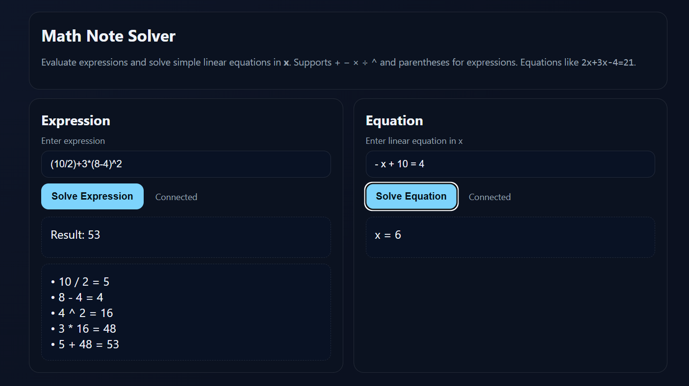

# Math Note Solver ✍️

### 🚀 Live Demo  
https://math-note-solver-production.up.railway.app



A full-stack web application that solves arithmetic expressions and linear equations with step-by-step explanation.

---

### ✨ Features
- Solve expressions like `5+3*2`, `(10/2)+3*4`, `3+4*2^2`
- Solve linear equations like `2x+3x-4=21`, `-x+10=4`
- Shows **every calculation step** for better understanding
- Backend: **Java + Spring Boot**
- Frontend: **HTML/CSS/JS** with Fetch API
- Runs fully in browser + Spring API (no database)

---

### 🧠 Tech Stack
| Layer | Technology |
|------|-------------|
| Backend | Java, Spring Boot, Maven |
| Frontend | HTML, CSS, JavaScript |
| Deployment | Railway (Free Cloud Hosting) |

---

### 🚀 How to Run Locally

#### 1) Clone the repository
```bash
git clone https://github.com/kush86005/math-note-solver.git
cd math-note-solver
